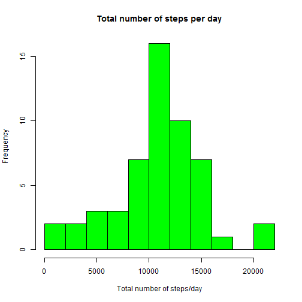
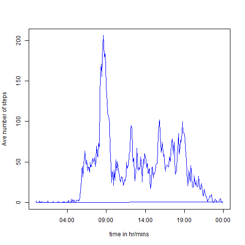
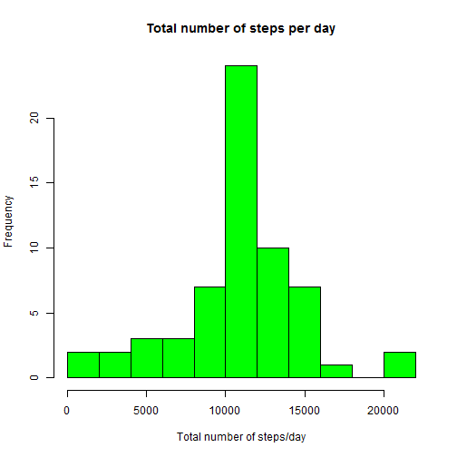
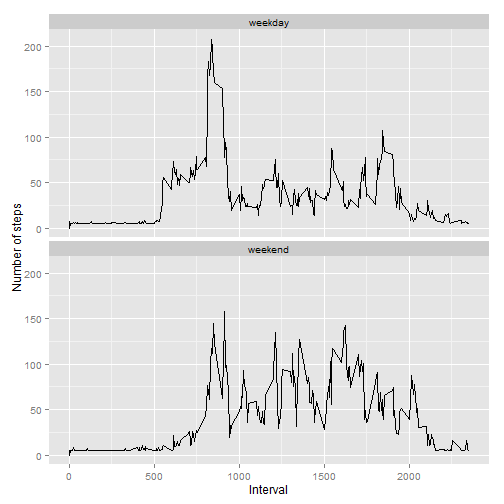

This is an R Markdown document/report on the daily activity pattern based on data collected from a personal monitoring device.  The data consists of 2 months of data collected from October to November 2012 and include the number of steps taken in 5-minute intervals each day. 

# Q.1 Total number of steps taken per day.


```r
library(plyr)
data <- read.csv("activity.csv")
str(data) # Structure of original data
```

```
## 'data.frame':	17568 obs. of  3 variables:
##  $ steps   : int  NA NA NA NA NA NA NA NA NA NA ...
##  $ date    : Factor w/ 61 levels "2012-10-01","2012-10-02",..: 1 1 1 1 1 1 1 1 1 1 ...
##  $ interval: int  0 5 10 15 20 25 30 35 40 45 ...
```

```r
head(data)
```

```
##   steps       date interval
## 1    NA 2012-10-01        0
## 2    NA 2012-10-01        5
## 3    NA 2012-10-01       10
## 4    NA 2012-10-01       15
## 5    NA 2012-10-01       20
## 6    NA 2012-10-01       25
```

```r
data$date <- as.Date(data$date)
data <- na.omit(data)
str(data) # Number of obs after removing NAs.
```

```
## 'data.frame':	15264 obs. of  3 variables:
##  $ steps   : int  0 0 0 0 0 0 0 0 0 0 ...
##  $ date    : Date, format: "2012-10-02" "2012-10-02" ...
##  $ interval: int  0 5 10 15 20 25 30 35 40 45 ...
##  - attr(*, "na.action")=Class 'omit'  Named int [1:2304] 1 2 3 4 5 6 7 8 9 10 ...
##   .. ..- attr(*, "names")= chr [1:2304] "1" "2" "3" "4" ...
```

```r
# Number of missing NAs = 17568-15264 = 2304

summary(data$steps)
```

```
##    Min. 1st Qu.  Median    Mean 3rd Qu.    Max. 
##    0.00    0.00    0.00   37.38   12.00  806.00
```

```r
data1 <- ddply(data, c("date"), summarise,
                  sum = sum (steps)) # split, apply and combine

summary(data1$sum) # mean and median value are shown here
```

```
##    Min. 1st Qu.  Median    Mean 3rd Qu.    Max. 
##      41    8841   10760   10770   13290   21190
```

```r
head(data1)
```

```
##         date   sum
## 1 2012-10-02   126
## 2 2012-10-03 11352
## 3 2012-10-04 12116
## 4 2012-10-05 13294
## 5 2012-10-06 15420
## 6 2012-10-07 11015
```

```r
str(data1)
```

```
## 'data.frame':	53 obs. of  2 variables:
##  $ date: Date, format: "2012-10-02" "2012-10-03" ...
##  $ sum : int  126 11352 12116 13294 15420 11015 12811 9900 10304 17382 ...
```

```r
hist(data1$sum, breaks=10, col="green", xlab="Total number of steps/day", main="Total number of steps per day")
```

 

From the summary(data1$sum), we can see that the mean is 10770 and median is 10760 for the total number of steps per day.

# Q.2 Average daily activity pattern and time series plot.

The code for the second part of this assignment on average daily activity pattern for the 5-minute interval:


```r
intdata<- ddply(data, c("interval"), summarise,
                mean = mean(steps))
intdata[289,1:2]<-c(0000,0)
intdata$interval<-format( seq.POSIXt(as.POSIXct(Sys.Date()), as.POSIXct(Sys.Date()+1), by = "5 min"),
        "%H%M", tz="GMT")
str(intdata)
```

```
## 'data.frame':	289 obs. of  2 variables:
##  $ interval: chr  "0000" "0005" "0010" "0015" ...
##  $ mean    : num  1.717 0.3396 0.1321 0.1509 0.0755 ...
```

```r
intdata$interval<-strptime(intdata$interval, "%H%M")

plot(intdata$interval,intdata$mean, type="l",xlab="time in hr/mins", ylab="Ave number of steps",col="blue")
```

 

```r
summary(intdata$mean) # Check the max mean value = 206.  
```

```
##    Min. 1st Qu.  Median    Mean 3rd Qu.    Max. 
##   0.000   2.245  33.530  37.250  52.660 206.200
```

```r
intdata[which(intdata$mean >= 206),] # Gives the time interval ie. 835 or 8.35 am for max value.
```

```
##                interval     mean
## 104 2015-11-17 08:35:00 206.1698
```
Therefore, the 5-minute time interval with the max number of steps is 0835-0840.

# Q3: Imputation: Replace NA with mean values

Since there are 2304 NA values compared to the total of more than 17000 observations, the best strategy is to replace missing (NA) values with the mean value so as not to skew the overall result of the activity study.


```r
data <- read.csv("activity.csv") # Read in original data with NAs
str(data)
```

```
## 'data.frame':	17568 obs. of  3 variables:
##  $ steps   : int  NA NA NA NA NA NA NA NA NA NA ...
##  $ date    : Factor w/ 61 levels "2012-10-01","2012-10-02",..: 1 1 1 1 1 1 1 1 1 1 ...
##  $ interval: int  0 5 10 15 20 25 30 35 40 45 ...
```

```r
data$steps[is.na(data$steps)] <- mean(data$steps, na.rm=TRUE) 
```

From the above data before and after removing the NAs, the total number of missing values = 17568-15264 = 2304
 

```r
data$date <- as.Date(data$date)
data1 <- ddply(data, c("date"), summarise,
               sum = sum (steps)) # split, apply and combine
hist(data1$sum, breaks=10, col="green", xlab="Total number of steps/day", main="Total number of steps per day")
```

 

```r
summary(data1$sum) #Not much change in mean and median
```

```
##    Min. 1st Qu.  Median    Mean 3rd Qu.    Max. 
##      41    9819   10770   10770   12810   21190
```
There is no change in the mean value (10770) when we replace the missing NAs with the mean value. There is also little change in the median value from 10760 to 10770. Therefore, in this case, there is no impact of imputing missing data on the estimates of the total daily number of steps.

#Q4: Activity Patterns -"weekday" and "weekend".

```r
data$date<-weekdays(data$date,abbreviate=TRUE)
str(data)
```

```
## 'data.frame':	17568 obs. of  3 variables:
##  $ steps   : num  37.4 37.4 37.4 37.4 37.4 ...
##  $ date    : chr  "Mon" "Mon" "Mon" "Mon" ...
##  $ interval: int  0 5 10 15 20 25 30 35 40 45 ...
```

```r
library(data.table)
```

```
## data.table 1.9.6  For help type ?data.table or https://github.com/Rdatatable/data.table/wiki
## The fastest way to learn (by data.table authors): https://www.datacamp.com/courses/data-analysis-the-data-table-way
```

```r
data1<-data[which(data$date == "Sat" | data$date== "Sun"),] # It works!!
data2<-data[which(data$date == "Mon" | data$date=="Tue" | data$date=="Wed" |data$date=="Thu"|data$date=="Fri"),]

names(data1)[2]<-"weekday"
names(data2)[2]<-"weekday"
wkdata1<- ddply(data1, c("interval"), summarise,
               mean = mean(steps))
wkdata1[289,1:2]<-c(0000,0)
wkdata1$interval<-format( seq.POSIXt(as.POSIXct(Sys.Date()), as.POSIXct(Sys.Date()+1), by = "5 min"),
                         "%H%M",tz="GMT") # Has 289
wkdata1$weekday<-rep("weekend",289) # need to add in variable for weekend
str(wkdata1)
```

```
## 'data.frame':	289 obs. of  3 variables:
##  $ interval: chr  "0000" "0005" "0010" "0015" ...
##  $ mean    : num  4.67 4.67 4.67 4.67 4.67 ...
##  $ weekday : chr  "weekend" "weekend" "weekend" "weekend" ...
```

```r
wkdata2<- ddply(data2, c("interval"), summarise,
                mean = mean(steps))
wkdata2[289,1:2]<-c(0000,0)
wkdata2$interval<-format( seq.POSIXt(as.POSIXct(Sys.Date()), as.POSIXct(Sys.Date()+1), by = "5 min"),
                          "%H%M",tz="GMT") # Has 289
wkdata2$weekday<-rep("weekday",289)# Need to add in variable for weekday

wkdata<-rbind(wkdata1,wkdata2)
str(wkdata) # 578 observations
```

```
## 'data.frame':	578 obs. of  3 variables:
##  $ interval: chr  "0000" "0005" "0010" "0015" ...
##  $ mean    : num  4.67 4.67 4.67 4.67 4.67 ...
##  $ weekday : chr  "weekend" "weekend" "weekend" "weekend" ...
```

```r
wkdata$interval<-as.integer(wkdata$interval)
# Panel plot
library(ggplot2)
hwc<-ggplot(wkdata,aes(x=interval,y=mean))+ geom_line() + labs(x ="Interval", y = "Number of steps")
hwc + facet_wrap(~ weekday, ncol=1)
```

 
